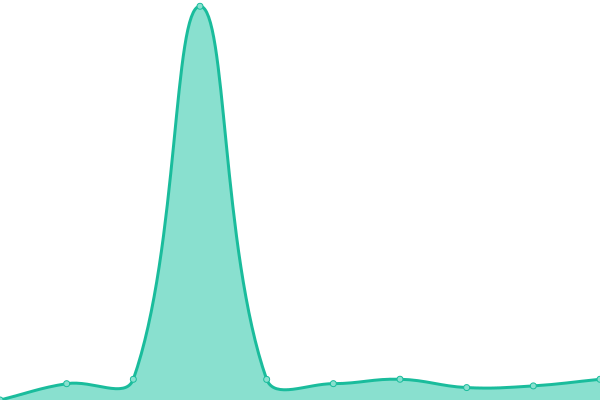
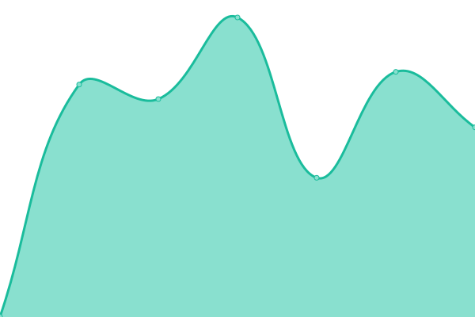
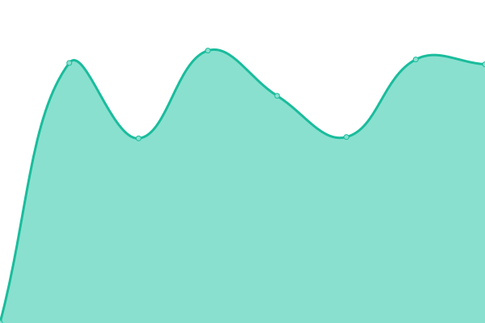

# [📈 Live Status](https://Ennogtal.github.io/upptime): <!--live status--> **🟩 All systems operational**

This repository contains the open-source uptime monitor and status page for [Ennogtal](https://ennogtal.com), powered by [Upptime](https://github.com/upptime/upptime).

With [Upptime](https://upptime.js.org), you can get your own unlimited and free uptime monitor and status page, powered entirely by a GitHub repository. We use [Issues](https://github.com/Ennogtal/upptime/issues) as incident reports, [Actions](https://github.com/Ennogtal/upptime/actions) as uptime monitors, and [Pages](https://Ennogtal.github.io/upptime) for the status page.

<!--start: status pages-->
<!-- This summary is generated by Upptime (https://github.com/upptime/upptime) -->
<!-- Do not edit this manually, your changes will be overwritten -->
<!-- prettier-ignore -->
| URL | Status | History | Response Time | Uptime |
| --- | ------ | ------- | ------------- | ------ |
|  [Landing page](https://ennogtal.com) | 🟩 Up | [landing-page.yml](https://github.com/ennogtal/upptime/commits/HEAD/history/landing-page.yml) | 

 718ms
     
 | 

<a href="https://Ennogtal.github.io/upptime/history/landing-page">100.00%</a>
    

|  BNP0YzcD | 🟩 Up | [bnp-0-yzc-d.yml](https://github.com/ennogtal/upptime/commits/HEAD/history/bnp-0-yzc-d.yml) | 

 4684ms
     
 | 

<a href="https://Ennogtal.github.io/upptime/history/bnp-0-yzc-d">93.71%</a>
    

|  Caq7vF3a | 🟩 Up | [caq7v-f3a.yml](https://github.com/ennogtal/upptime/commits/HEAD/history/caq7v-f3a.yml) | 

 710ms
     
 | 

<a href="https://Ennogtal.github.io/upptime/history/caq7v-f3a">100.00%</a>
    

|  BW2cdq3i | 🟩 Up | [bw-2cdq3i.yml](https://github.com/ennogtal/upptime/commits/HEAD/history/bw-2cdq3i.yml) | 

 829ms
     
 | 

<a href="https://Ennogtal.github.io/upptime/history/bw-2cdq3i">100.00%</a>
    

<!--end: status pages-->

[**Visit our status website →**](https://Ennogtal.github.io/upptime)

## 📄 License

- Powered by: [Upptime](https://github.com/upptime/upptime)
- Code: [MIT](./LICENSE) © [Ennogtal](https://ennogtal.com)
- Data in the `./history` directory: [Open Database License](https://opendatacommons.org/licenses/odbl/1-0/)
