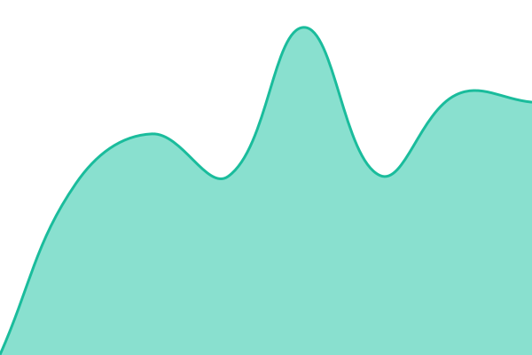
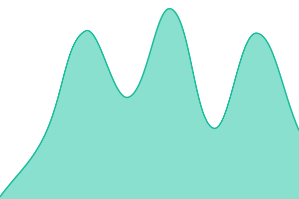

# [📈 Live Status](https://Ennogtal.github.io/upptime): <!--live status--> **🟧 Partial outage**

This repository contains the open-source uptime monitor and status page for [Ennogtal](https://ennogtal.com), powered by [Upptime](https://github.com/upptime/upptime).

With [Upptime](https://upptime.js.org), you can get your own unlimited and free uptime monitor and status page, powered entirely by a GitHub repository. We use [Issues](https://github.com/Ennogtal/upptime/issues) as incident reports, [Actions](https://github.com/Ennogtal/upptime/actions) as uptime monitors, and [Pages](https://Ennogtal.github.io/upptime) for the status page.

<!--start: status pages-->
<!-- This summary is generated by Upptime (https://github.com/upptime/upptime) -->
<!-- Do not edit this manually, your changes will be overwritten -->
<!-- prettier-ignore -->
| URL | Status | History | Response Time | Uptime |
| --- | ------ | ------- | ------------- | ------ |
|  [Landing page](https://ennogtal.com) | 🟩 Up | [landing-page.yml](https://github.com/ennogtal/upptime/commits/HEAD/history/landing-page.yml) | 

 885ms
     
 | 

<a href="https://Ennogtal.github.io/upptime/history/landing-page">100.00%</a>
    

|  AoEWtEF4 | 🟥 Down | [ao-e-wt-ef-4.yml](https://github.com/ennogtal/upptime/commits/HEAD/history/ao-e-wt-ef-4.yml) | 

 557ms
     
 | 

<a href="https://Ennogtal.github.io/upptime/history/ao-e-wt-ef-4">0.00%</a>
    

|  1RMxcPPy | 🟩 Up | [1-r-mxc-p-py.yml](https://github.com/ennogtal/upptime/commits/HEAD/history/1-r-mxc-p-py.yml) | 

 1323ms
     
 | 

<a href="https://Ennogtal.github.io/upptime/history/1-r-mxc-p-py">100.00%</a>
    

<!--end: status pages-->

[**Visit our status website →**](https://Ennogtal.github.io/upptime)

## 📄 License

- Powered by: [Upptime](https://github.com/upptime/upptime)
- Code: [MIT](./LICENSE) © [Ennogtal](https://ennogtal.com)
- Data in the `./history` directory: [Open Database License](https://opendatacommons.org/licenses/odbl/1-0/)
